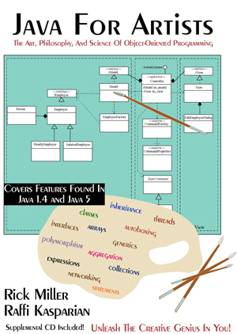

# JavaForArtists-1stEdition
Source code examples from the book Java For Artists: The Art, Philosophy, and Science of Object-Oriented Programming, 1st Edition. The material in this book is dated but interesting. The GUI code doesn't work any more, not on modern Java Runtimes anyway, although Raffi Kasparian worked magic with Swing internals. And sadly, Applets aren't a thing anymore. 

This book is available free for download from Pulp Free Press.

<a href="https://pulpfreepress.com"></img></a>

